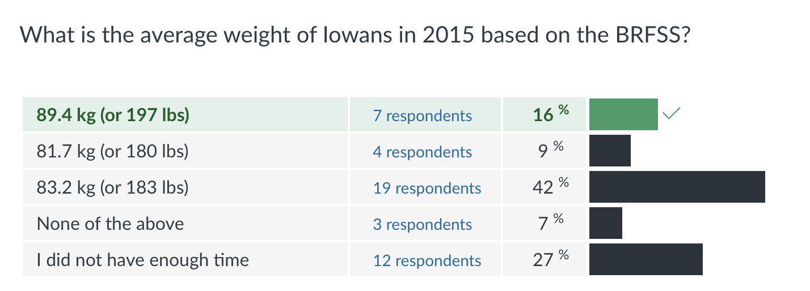
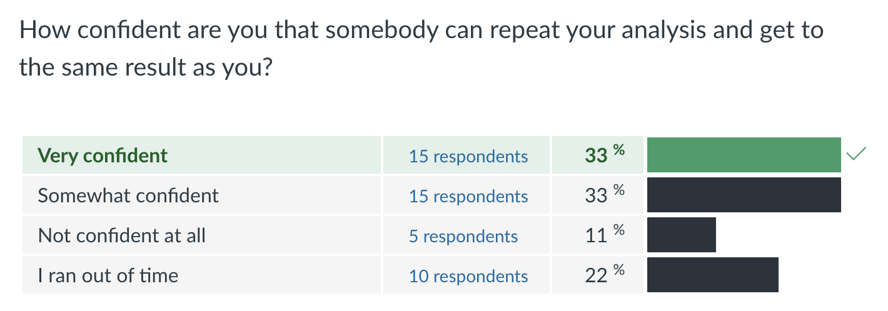
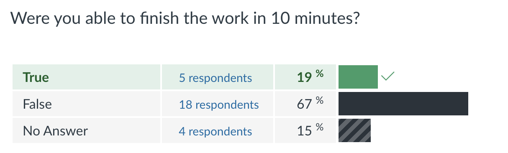

```{r setup, include=FALSE, message=FALSE, warning=FALSE}
options(htmltools.dir.version = FALSE)
library(tidyverse)
```

## One last thing ...

### Imagine the following situation: 

it's your last day before you go on your summer vacation after a stressful stretch of work. 
The last two weeks were filled with deadline after deadline for all of your projects. 

--


You are planning to leave in a couple of minutes. 

--

Your boss storms in ... "I'm glad I still caught you, I need to know, what the average weight of Iowans was in 2015. We have three different numbers and I know which one is the right one."

Before you can explain that you won't be here for the next couple of weeks, she is gone.

--


Two minutes later you get a text with two links:

"Don't forget to put in a blurb about how you got the number and stuff"

- [2015 BRFSS records](https://raw.githubusercontent.com/Stat585-at-ISU/materials-2023/main/01_collaborative-environment/data/brfss_iowa.csv)
- [Codebook](https://www.cdc.gov/brfss/annual_data/2015/pdf/codebook15_llcp.pdf)


---
## How bad can it be?

- You confidently download the data in your favorite analysis software (this does not have to be R!)

- and take a look at the data.

---

<!--
## A test case

The dataset `brfss_iowa.csv` (linked from website) contains 6227 records from the Behavioral Risk Factor Surveillance System (BRFSS) for Iowans.

> The Behavioral Risk Factor Surveillance System (BRFSS) is the nation's premier system of health-related telephone surveys that collect state data about U.S. residents regarding their health-related risk behaviors.

It is conducted annually by the Center for Disease Control and Prevention (CDC).

Codebook with detailed explanations of variables is [available here](https://www.cdc.gov/brfss/annual_data/2015/pdf/codebook15_llcp.pdf).
-->

## ... still imagining

```{r, echo=FALSE, out.width="50%", fig.cap="...", fig.alt="series of icons of a person at work. the person is obviously not happy with work."}

```


---
class: inverse
## Your turn

Prompt:

> I need to know, what the average weight of Iowans was in 2015."

> Don't forget to put in a blurb about how you got your number

Two related links:

- [2015 BRFSS records](https://raw.githubusercontent.com/Stat585-at-ISU/materials-2023/main/01_collaborative-environment/data/brfss_iowa.csv)
- [Codebook](https://www.cdc.gov/brfss/annual_data/2015/pdf/codebook15_llcp.pdf)


In the next 5 mins:

--

1. Work on this problem

--

2. When the alarm rings, save your work, go to Canvas and answer the survey "a dispute". 

<!--
0. Complete the following tasks and **write instructions / documentation** for a collaborator to be able to reproduce your findings.

1. Verify that there are 6227 cases (= number of interviews) in the data. 

2. Verify that there are variables `WEIGHT2` and `HEIGHT3` in the data and read the description of the variables in the codebook. 

3. How are height and weight related? Find correlations of weight and height by gender (`SEX`). How many values are the correlations based on for each gender?

2. Write a short report of your findings. Address potential problems in the data.

-->
---
class: inverse, middle, center
background-image: url(https://github.com/Stat585-at-ISU/materials-2023/raw/main/01_collaborative-environment/images/view.jpg)
background-size: contain


---

## This is where we are

This is the average weight of Iowans  ...

```{r, echo=FALSE, out.width="80%", fig.cap="", fig.alt="Barchart with a breakdown of solutions. Solution #3 is supported the most."}

```

--

How confident are you  ...

```{r, echo=FALSE, out.width="80%", fig.cap="", fig.alt="Barchart with a breakdown of predicted outcomes. 60% are confident or very confident that their results can be reproduced."}

```
---
## ... meanwhile at the office

### Imagine you are the boss

Again, you don't have time, and you want to get this  piece of work done as quickly as possible

---
class: inverse
## Your Turn
In the next 5 mins:

1. Go to Canvas, find the assignment for peer-review

2. Download all of the documents

3. Check your employee's work. 

4. When the alarm rings, stop the work and go back to Canvas. 


---

## How did that go? 


Thanks to  Jenny Bryan and Mine Cetinkaya-Rundel for the idea for the original  example.

<!---->

---

## Reflection

- Were you successful in reproducing each others' work? 

- Where did things get problematic? 
  
  - time is always too short, no matter how much you have
  - time is also our most strictly limited resource for now
  - a good system will help us save time

- What tools did you use?


---

## What if?

- What would happen if your collaborator is no longer available to walk you through 
their analysis?

- What made it easy / hard for reproducing your partners' work?

- What would have to happen if 

    - you had to swap out the dataset?
    
    - you had to extend the analysis further?
    
    - you caught further data errors and had to re-create the analysis
    with corrections?
    
    - you had to revert back to the original dataset?

---

## Summary

- Everyone struggles with reproducibility and it is a hindrance to moving 
science forward

- [THE checklist](checklist.md), developed by Jenny Bryan and Mine Cetinkaya-Rundel


- Even with a fairly simple analysis we face challenges in four main areas:
organization, documentation, automation, and dissemination

---
class: inverse, middle, center
# Facets of reproducibility

---

## Four facets of reproducibility

1. **Documentation:** 
    - *We will:* Use markdown to document our workflow so that anyone can pick up our
    data and follow what we are doing
    - *We will:* Use literate programming so that our analysis and our results are
    tightly connected, or better yet, inseparable

2. **Organization:** tools to organize our projects so that we don't have a single 
folder with hundreds of files

3. **Automation:** the power of scripting to create automated data analyses

4. **Dissemination:** publishing is not the end of your analysis, rather it is a way 
station towards  future research and the future research of others


