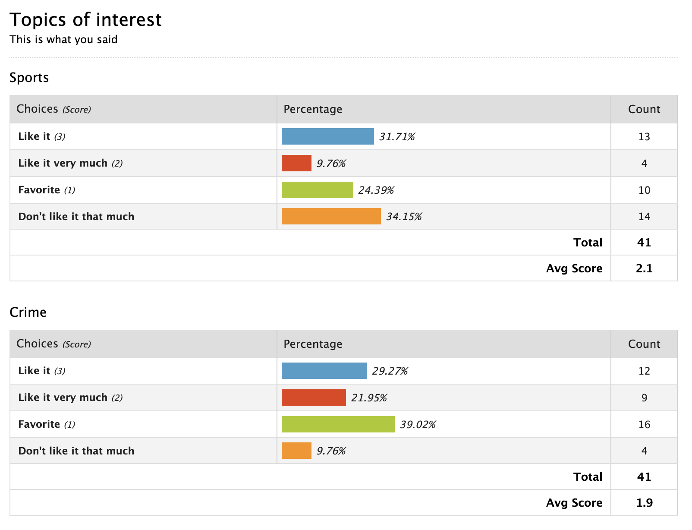

class: inverse, center, middle

```{r setup, include=FALSE}
knitr::opts_chunk$set(echo = TRUE)
library(tidyverse)
```
# Vote on topics

---

## ... this is what wufoo tells us


  
  ... there's eight more of these charts ... which topic is the best?

---

## 

... this is what the raw data looks like ...

```{r, echo=FALSE}
topics <- read.csv("data/topics-2023.csv")
topics <- topics %>% select(-Entry.Id)
head(topics)
```


---

## All topics in one

```{r, echo=FALSE, fig.width = 10, fig.height = 6}
tlong <- topics %>% pivot_longer(cols=8:17, names_to="topic", values_to="rating")
tlong %>% 
  ggplot(aes(x = rating)) + geom_bar(aes(fill=rating)) +
  facet_wrap(~topic, ncol=5) +
  theme(legend.position="bottom")
```


---

## ... in the right order ...

```{r, echo=FALSE, fig.width = 10, fig.height = 6}
tlong <- tlong %>% mutate(
  rating = factor(rating, 
                  levels= c("Favorite", "Like it very much",
                            "Like it", "Don't like it that much"))
)
tlong %>% 
  ggplot(aes(x = rating)) + geom_bar(aes(fill=rating)) +
  facet_wrap(~topic, ncol=5) +
  theme(legend.position="bottom")
```

---

## ... better color scheme ...

```{r, echo=FALSE, fig.width = 10, fig.height = 6}
library(RColorBrewer)
cols <- brewer.pal("RdBu", n = 8)

tlong %>% 
  ggplot(aes(x = rating)) + geom_bar(aes(fill=rating)) +
  facet_wrap(~topic, ncol=5) +
  theme(legend.position="bottom") +
  scale_fill_manual(values = cols[c(8,7,6,1)])
```

---

## ... comparisons across topics ...

```{r, echo=FALSE, fig.width = 10, fig.height = 6}
library(RColorBrewer)
cols <- brewer.pal("RdBu", n = 8)

tlong %>% 
  ggplot(aes(x = topic)) + geom_bar(aes(fill=rating)) +
  theme(legend.position="bottom") +
  scale_fill_manual(values = cols[c(8,7,6,1)])
```

---

## ... with readable topics ...

```{r, echo=FALSE, fig.width = 10, fig.height = 6}
tlong %>% 
  ggplot(aes(x = topic)) + geom_bar(aes(fill=rating)) +
  theme(legend.position="bottom") +
  scale_fill_manual(values = cols[c(8,7,6,1)]) +
  coord_flip()
```

---

## close to a final picture

```{r, echo=FALSE, fig.width = 10, fig.height = 6}
tlong %>% 
  ggplot(aes(x = topic)) + geom_bar(aes(fill=rating)) +
  theme(legend.position="bottom") +
  scale_fill_manual(values = cols[c(8,7,6,1)]) +
  coord_flip() + 
  theme(axis.text.y = element_blank()) +
  scale_y_reverse() +
  geom_text(aes(x = topic, label = topic), 
            data = tlong %>% select(topic) %>% unique(), 
            y = -nrow(topics)+1, colour="white", hjust=0)
```

---

##  THIS is what you said:

```{r, echo=FALSE, fig.width = 10, fig.height = 6}
tlong <- tlong %>% 
  mutate(
        topic = reorder(topic, rating, FUN=function(x) 
          sum(x %in% c("Favorite"))),
        topic = reorder(topic, rating, FUN=function(x) 
          sum(x %in% c("Favorite", "Like it very much"))),
    topic = reorder(topic, rating, FUN=function(x) 
          -sum(x == "Don't like it that much"))
  )
tlong %>% 
  ggplot(aes(x = topic)) + geom_bar(aes(fill=rating)) +
  scale_fill_manual(values = cols[c(8,7,6,1)]) +
  coord_flip() + 
  scale_y_reverse() +
  geom_text(aes(x = topic, label = topic), 
            data = tlong %>% select(topic) %>% unique(),
            y = -nrow(topics)+1, colour="white", hjust=0) +
  ggtitle("Topics in order of popularity") +
  xlab("") +
  theme_bw() +
  theme(legend.position="bottom") +
  theme(axis.ticks.y = element_blank(), 
        axis.text.y = element_blank())
```

---

## Additional Topics

Range of other suggestions: 
  
Everything mentioned once or twice ... great for final projects `r emo::ji("smile")`!
  
Education data (science, online learning, cognitive abilities, self-rating of abilities), agricultural data (seeds, pesticides, genomics), psychology and law, health: sleep, housing, media use, engineering/manufacturing, auto racing


