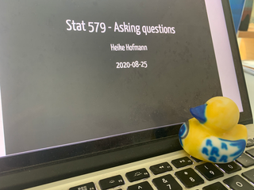

class: inverse, center, middle

```{r setup, include=FALSE}
knitr::opts_chunk$set(echo = TRUE)
library(tidyverse)
```
# Where do you go for help?

---
## Office hours

Office hours section 1: Tuesday 2-3 (after class, same zoom link)


TA: An Nguyen 

email: atn@iastate.edu

Office hour: TBD

---

## Asking a good question

- What are you working on/trying to do?

- What problem have you run into (error message in case it is R)

- What have you done to try to fix the problem?


Try to explain your rubber duck what is going wrong (https://en.wikipedia.org/wiki/Rubber_duck_debugging#cite_note-4). 


---

## Asking a good question

is a learned and valuable skill! 

Have a look at:

- stackoverflow's [Asking a good question](http://stackoverflow.com/help/how-to-ask)

- R's [Posting guidelines](https://www.r-project.org/posting-guide.html)

---

## First aid for help

There's lots of ways to get help in case you are stuck:

1. Google is your friend! in particular, stackoverflow and R help are usually great resources,

2. ask a team member,

3. write email to the instructor with your question, but please avoid any [lmgtfy](http://lmgtfy.com/?q=What+does+lmgtfy+mean?) questions!
