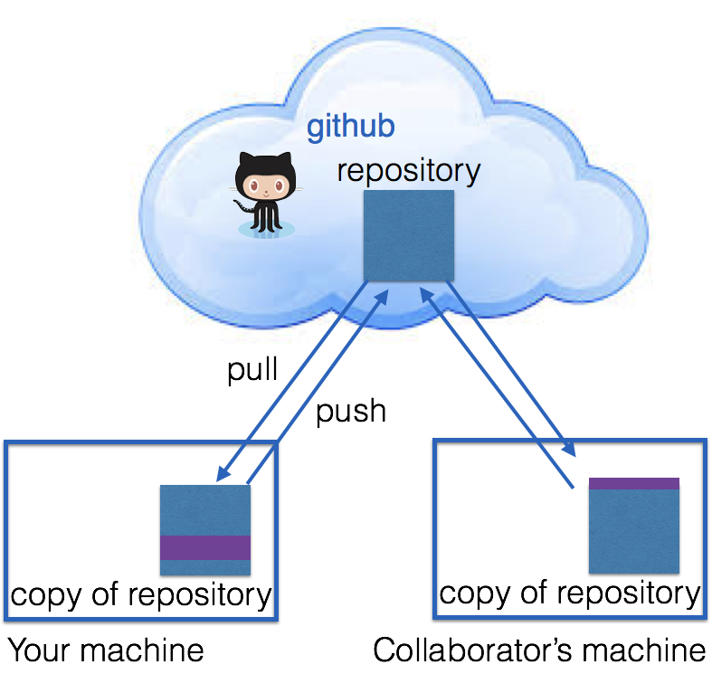

```{r setup, include=FALSE}
knitr::opts_chunk$set(echo = TRUE)
```

## Why git?


http://xkcd.com/1597/

---

## What is git?

- **Git** is a *version control system* that was created to help developers manage collaborative software projects. Git tracks the evolution of a set of files, called a **repository** or **repo**. 

- This helps us
    - *merge* conflicts that arise from collaboration
    - *rollback* to previous versions of files as necessary
    - store *master* versions of files, no more `paper_final_final_I_really_mean_it.docx`

---

## GitHub 

[GitHub](github.com) is one of many hosting services
(others are e.g. [Bitbucket](bitbucket.org), [GitLab](about.gitlab.com), etc.). 



---
class: inverse
## Your Turn (5 min) 


This Your Turn is just a prep to get ready for a bigger Your Turn later. 
It'll take a couple of minutes of your time, but may need more time from github ... 


Here goes: Do you have a github account? 

- No? Create a _free_ account at https://github.com/

- Yes? Then log into it. 
    - Do you remember your login and password? If not, try out different emails and let github send you the info.

---

## Git Terminology

from [github glossary](https://help.github.com/articles/github-glossary/)

- **Repository:** the basic element of git - like a project's folder. A repository contains all of the project files, and their __revision history__. One person owns a repository, multiple people can collaborate. Can be either public or private.

- **Remote:** This is the version of something that is hosted on a server. It can be (and usually is) connected to a local clone.

- **Clone:** A local copy of a repository that lives on your computer instead of on a website's server somewhere

- **Fork:** a remote copy of a repository stored under your account.Forks allow you to freely make changes to a project without affecting the original. 

---

## Terminology (cont'd)


- **Pull:** When you are fetching changes from the remote repository and merging them with your local clone. 

- **Commit:** A checkpoint for the local clone to save changes to a file (or set of files). Every time you commit, git creates a unique ID that allows you to keep record of what changes were made when and by who.

- **Push:** Sending your committed changes to the remote repository.


---

# git workflow:


- Pull, *make changes*, Commit, Push

- Pull, *make changes*, Commit, Push

- Pull, *make changes*, Commit, Push

---

## Repositories

By default, all materials on GitHub are **public**. This is *good* because you are getting your work out there and contributing to the open source community! 

You have some limited number of **private** repos.
If you need more checkout [GitHub for Education](https://education.github.com/) - free private repos for students/postdocs/professors.


---
class: middle, center
# Big 'Your turn' coming up!

---

## Overview

In this activity you are going to learn how to collaborate using Github.  With a partner you will learn some basics which allow you to share and edit files on Github. 

1. Create a git repository hosted at GitHub

2. Build `README.md` file 

3. Commit changes to repository

3. Collaborate by forking and editing partners file

4. Explore Github features: graphs, diff, blame, ect.

---
class: inverse
## Create a repository with a README.md file (10 minutes)

**Step 1**: First we are going to create a repository within our Github user account. 

Follow along with your instructor and perform these steps:

1. Go to your Github profile. The url should be [http://github/your-user-name]().

2. Create a new Github repository, click <span style="background:limegreen; color:white">new</span> button, under the repositories tab.

3. Name your repository `stat579-your-username`

4. In the details write "my first github repo".

5. Click the initiate a `README.md file` option. 

---

## So far

-  Once the repository is created you will be directed to the repository page which now has its own web address. 

-  Each repository on Github has a unique url so you can easily share. 

-  The git history is a detailed history of all the changes made to that file.  One of the features of using Github is the ability to view your repository history which are displayed in the Graphs section of your Github repository page. 

-  At this point in the git history of your `stat579-your-username` repository there is only one commit.

---
class: inverse
## Edit the `README.md` file (5 minutes)

1.  Go to the `stat579-your-username` repository main page. Click on `README.md`, then click "edit this file". Add the following information into the `README.md` file:
    -  (User) Name?
    
    -  In the past month, what are the three main activities you have been doing?
    
    - What kind of data are you usually working with?
    
    -  What are the three most important tools/strategies you use for analyzing data?


*tip*:  Notice that you can use markdown syntax. Use [this guide](https://help.github.com/articles/markdown-basics/) for Github's flavor of Markdown. Use the "Preview" button to view the formatting of your readme.md file. 

---

## Commit

- **Commit** takes a snap shot of your project. Each commit includes a commit message that concisely defines changes made or project state at the time of the commit. 

1. Summarize the changes that you have made in 50 characters or less and click the <span style="background:limegreen; color:white"> commit </span>    button. 

2. Check out the git history.  You should now see two commits.

---

## Commit statements

Get into the habit of writing commit statements. They will help you later!

http://starlogs.net/#heike/rwrks

http://starlogs.net/#Stat579-at-ISU/materials

---
class: middle, center
# Edit and collaborate with your partner

---

## Collaborate 

Now it is time to collaborate with your partner.   In order to edit someone else's repository you usually follow this simplified work flow: 

1. Fork their repository to your user account 

2. Make edits and commit 

3. Create a pull request that merges your changes into their repository. 


*tip*: Depending on the project there are variations on the above work flow. Often the rules for contributing to a project are outlined in a file called `CONTRIBUTING.md` within the repository. One of the more often used works flows is [Github Flow](https://guides.github.com/introduction/flow/). 

---

## Forking

- **Forking** is creating a copy of a git repository into your own account.  

-  Forking allows you to make changes to a repository without affecting the main repository of the project.  

-  This is one of the most fundamental aspects of Github - you essentially encouraged to copy and play with anyone's code! 

---
class: inverse
## Forking

0. Navigate to your partner's repository by typing the url directly into your address bar.

1.  To fork your partner's repository click the "fork" button in the top left hand part of your screen.  

2.  When it asks where you would like to fork the repository, choose your user account (if you are new to Github, this should be the only option).

---
class: inverse
## Make edits and commit

- You should now have a copy of your partners repository, `stat579-their-username`. 

-  Github keeps track of the entire git history of the project and all forked copies made of the project. 

1. Edit your partners repository by clicking the edit button.  

2.  Paste in the answers to your questions under theirs and make a commit. 
---
class: inverse
## Create a pull request

- A **pull request** is the final step in the collaboration process, essentially asking if the edits made to your copy can be incorporated into another repository. 

1.  Make sure you are in your copy of your partner's repository by looking at the url - your user name should preface the repository name.

2.  Click the  <span style="background:limegreen; color:white">New Pull Request</span> button. You will get an overview of the changes you made to the repository. 

3.  Click the "Create a Pull Request" button to continue the pull request. Your partner will now get a notification of a pull request on their main repository, as will you if your partner made changes. 

4. Partner: Go ahead and accept this pull request. 

---

## Explore Github Features

Now that you have accepted the pull request.  Take a few minutes to explore the git history using the Graphs section of the repository. 

---
class: middle, center
# We're done!

---

## Looking ahead ... 

In this class we will use git & github for the final project


## Resources

- Jenny Bryant's: Happy Git with R http://happygitwithr.com/

- Data Carpentry's tutorials: https://github.com/datacarpentry

- Reproducible Science Curriculum intitative: https://github.com/Reproducible-Science-Curriculum

