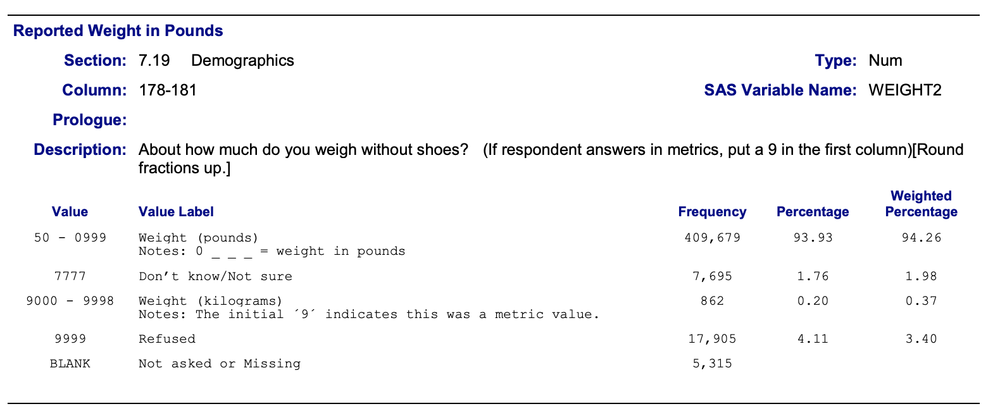

```{r setup, include=FALSE}
options(htmltools.dir.version = FALSE)
```


# A 'Solution' to the test case 


## A Plan of work

0. Find out where the data comes from

1. Describe the working environment 

2. Verify that there is a variable for weight in the data and read the description of the variables in the codebook. 

3. Calculate average for weight, then report.

5. Write a short report of your findings. Address potential problems in the data.


---

# A solution attempt

0. Setup 

    - this solution uses R v4.3.2 in RStudio (2023.06.2 Build 561). 
    - You need the R packages `tidyverse` and `rmarkdown` to run the solution
    - use the command `install.packages(c("tidyverse","rmarkdown"))` 
    in the R console to install the two packages

1. Navigate to https://github.com/Stat579-at-ISU/materials-2023

2. Download  the file [`test-case-solution.Rmd`](https://raw.githubusercontent.com/Stat579-at-ISU/materials-2023/master/01_collaborative-environment/test-case-solution.Rmd) in folder  `01_collaborative-environment`  in RStudio to get this set of slides.

3. "Knit" the file (Click on the button in the menu).

---

## The Data Source

The dataset `brfss_iowa.csv` (linked from website) contains 6227 records from the Behavioral Risk Factor Surveillance System (BRFSS) for Iowans.

> The Behavioral Risk Factor Surveillance System (BRFSS) is the nation's premier system of health-related telephone surveys that collect state data about U.S. residents regarding their health-related risk behaviors.

It is conducted annually by the Center for Disease Control and Prevention (CDC).

Codebook with detailed explanations of variables is [available here](https://www.cdc.gov/brfss/annual_data/2015/pdf/codebook15_llcp.pdf).


---


## What is Iowan's average weigth in 2015? 

Read the data: 

```{r message = FALSE, warning=FALSE}
library(tidyverse)
iowa <- readr::read_csv("https://github.com/Stat579-at-ISU/materials/raw/master/01_collaborative-environment/data/brfss_iowa.csv") 
# the read_csv function from the readr package is faster than the standard read.csv
# but the output is a tibble (we'll come back to that)

iowa
```

---

## Variables for weight

```{r, message = FALSE}
grep("WEIGHT", names(iowa), value=TRUE)


iowa %>% select(WEIGHT2) %>% head()
```

Variable is there ... let's plot it ...

---

## Plot 

Load the `ggplot2` package to plot weight:
```{r message = FALSE, fig.width=7, fig.height = 3.5, warning = FALSE}
iowa %>% 
  ggplot(aes(x = WEIGHT2)) + geom_histogram()
```

There are some very odd values. Check the codebook.


---

## Codebook excerpt

From the [codebook](https://www.cdc.gov/brfss/annual_data/2015/pdf/codebook15_llcp.pdf): WEIGHT2 is the originally recorded variables.



--

Values are a mix of metric and empirial values, refusals are coded as 9999 and don't know's as 7777.

---

## Next steps

Obviously, we need to spend some time cleaning these variables before we can make use of them. 

We have a couple of choices : 

1. We can buckle down and do that clean-up and then move on to the calculation.

2. We can take another look at the variables and investigate `WTKG3` are ... 

---

## Route 2

Let's take the second route first and draw a picture weight in metric units:

```{r message = FALSE, warning = FALSE, fig.width = 5.5, fig.height = 2.5}
iowa %>% 
  ggplot(aes(x = WTKG3)) + geom_histogram() + 
  facet_grid(.~SEX) 
```

These values look much better! But the weight is reported in tens of grams (???)

---

## Look at the variable's values

Based on variable `WTKG3`

```{r}
summary(iowa$WTKG3) # divide by 100 for kg

summary(iowa$WTKG3/45.4) # in pounds
```

--

This was solution number 3:  83.2 kg (or 183 lbs)

---

## How did we get the other values?

Based on variable `WEIGHT2`

```{r}
summary(iowa$WEIGHT2) # don't do this!!!
```

This mean was the inspiration for solution #1 of 89.4 kg. (This is the only very wrong answer)

The median was used for solution #2 of 180 lbs. 


---

## Another way to get solution #2:

```{r}
iowa %>% filter(WEIGHT2 < 7777) %>% select(WEIGHT2) %>% 
  summarize(n = n(), mean_lbs = mean(WEIGHT2), mean_kgs = mean(WEIGHT2*.454))

# number of metric responses:
filter(iowa, between(WEIGHT2, 9001, 9500)) %>% nrow()
```

---

## Route 1

This is quite a bit more work. Don't do things this way!

```{r}
# first of all, replace all missing values by NAs
iowa <- iowa %>% mutate(
  WEIGHT2 = replace(WEIGHT2, WEIGHT2 %in% c(7777,9999), NA)
)
```

---

## Route 1 (cont'd.)

1 pound is 0.454 kg: convert to metric:

```{r}
iowa <- iowa %>% mutate(
  weight = ifelse(WEIGHT2 >= 9000, 
                  WEIGHT2 - 9000, # transform all metric values by subtracting 9000
                  WEIGHT2*.454 # 1 lbs = 0.454 kg
                  )
)
```

---

## Route 1

```{r warning = FALSE}
iowa %>% 
  select(WEIGHT2, WTKG3, weight) %>% summary()
```

---

## Recap 

- Route 1 and 2 give identical solutions

- Read the codebook, visualize the data, even if the question does not ask for it.


---

## Recap

- this slide deck is rendered from an R Markdown document, located at [a github repo](https://github.com/Stat579-at-ISU/materials-2023/tree/master/01_collaborative-environment).

- code and text/documentation are interwoven: reproducible and self-documenting.

- extend or refine analyses by copying and modifying code blocks.

- disseminate your work by sharing the RMarkdown file
