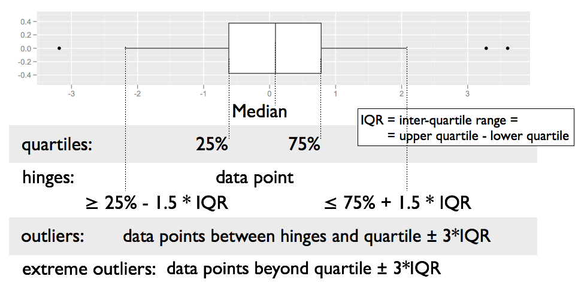

class: inverse, center, middle
# Looking ... some more ... at data

---

## Plan for answers

1. Explore how one (or more) variables are distributed: *barchart or histogram*

2. Explore how two variables are related:  *scatterplot, boxplot, tile plot*

3. Explore how two variables are related, conditioned on other variables: *facetting, color & other aesthetics*

Look at 3 next, then come back to 1 and 2.

---

## Getting ready

Load libraries:

```{r}
library(ggplot2) 
# not found? run install.packages("ggplot2")

library(classdata) 
# not found? run remotes::install_github("heike/classdata")
```

---

## Facetting

Can facet to display plots for different subsets: `facet_wrap`, `facet_grid`

```{r, message=FALSE}
ggplot(aes(x = Year, y = Murder), data=fbiwide) +
  facet_wrap(~State) +
  geom_point()
```

---

## Setup of `facet_wrap` and `facet_grid`

- `facet_grid` has formula specification: `rows ~ cols`

- `facet_wrap` has specification `~ variables` 

- multiple variables (in either specification) are included in form of a sum, i.e. `rowvar1 + rowvar2 ~ colvar1+ colvar2`

- no variable (in `facet_grid`) is written as `.`, i.e. `rowvar ~ .` are plots in a single column.

---
class: inverse
## Your turn 

Use the `fbiwide` data from the package `classdata` for this your turn.

- Plot the number of car thefts by year for each state (facet by state).

- The numbers are dominated by the number of thefts in California, New York, and Texas. Use a log-scale for the y-axis. Does that help?

- Another approach to fix the domination by CA, TX and NY: Read up on the parameters in `facet_wrap` to find a way to give each panel its own scale. Comment on the difference in the results.

---

## Facets vs aesthetics?

- Will need to experiment as to which one answers your question/tells the story best

- Rule of thumb: comparisons of interest should be close together

---

## Boxplots

```{r, echo=FALSE, warning=FALSE, fig.width = 8, fig.height = 5}
ggplot(data = fbi, aes(x = Type, y = log10(Count))) + geom_boxplot() + coord_flip()
```

---

## Boxplot definition

- definition by J.W. Tukey (1960s, EDA 1977)



---

## Boxplots

- are used for group comparisons and outlier identifications

- usually only make sense in form of side-by-side boxplots.

- `geom_boxplot` in ggplot2 needs `x` and `y` variable (`y` is measurement, `x` is categorical)

```{r}
ggplot(data = fbi, aes(x = Type, y = log10(Count))) +
  geom_boxplot() + 
  coord_flip()
```


---
class: inverse
## Your turn 


- Using ggplot2, draw side-by-side boxplots of the number of robberies by state. Use a log transformation on y and compare results.

- **Stretch goal:** Compare rates of robberies by state, i.e. adjust robberies by the state population. Then plot side-by-side boxplots. 

---

## Boxplots - Pros and Cons

- **Pros:**
    - Symmetry vs Skewness
    - Outliers
    - Quick Summary
    - Comparisons across multiple Treatments (side by side boxplots)

- **Cons:**
    - Boxplots hide multiple modes and gaps in the data


---

## Univariate plots

Histograms: 

```{r, fig.width=4, fig.height=3}
ggplot(fbiwide, aes(x = Motor.vehicle.theft)) + 
  geom_histogram(binwidth=5000) +
  ggtitle("binwidth = 5000")
```

---

## Univariate plots

Histograms: 

```{r, fig.width=4, fig.height=3}
ggplot(fbiwide, aes(x = Motor.vehicle.theft)) + 
  geom_histogram(binwidth=1000) +
  ggtitle("binwidth = 1000")
```

Always change the bin width! There is no perfect bin width, but a lot of different views of the data at different resolutions!
---

## Barchart

```{r}
ggplot(fbi, aes(x = Type)) + 
  geom_bar(aes(weight= Count)) +
  coord_flip()
```

---

## Weighted vs Unweighted Barcharts

Unweighted/regular barchart: categorical variable $X$ with $K$ levels: $x_1, ..., x_n \in \{C_1, ..., C_k\}$

A weighted barchart has an additional numeric variable $W$ of weights $w_1, ..., w_n$ with $w_i \ge 0, 1 \ge i \ge n$.

Mathematically, both barcharts are a visualization of a set of tuples of the form $(C_k, y_k)$, where for $1 \ge k \ge K$:

regular barchart: 
$$y_k = \sum_{i=1}^n I{(x_i = C_k)}$$

Weighted barchart:
$$y_k = \sum_{i=1}^n w_i \cdot I({x_i = C_k})$$

where $I$ is the indicator function, i.e. $I(x) = 1$ if $x$ is true, and $I(x) = 0$ if $x$ is false
---

## Histograms and barcharts

What do we look for?

- Symmetry/Skewness

- Modes, Groups  (big pattern: where is the bulk of the data?)

- Gaps & Outliers (deviation from the big pattern: where are the other points?)


For the histogram, always choose the binwidth consciously

In a barchart, choose the order of the categories consciously (later)

---
class: inverse
## Your turn 


- Use the `fbi` data set to draw a barchart of the variable `Violent Crime`. Make the height of the bars dependent on the number of reports (use `weight`). Then facet by type (does the result match your expectation? good! get rid of facetting). Color bars by `Type`. 

- Use the `fbi` data set to draw a histogram of the number of reports. Facet by type, make sure to use individual scales for the panels. 

---

## More on `ggplot2`

- reference/document: http://ggplot2.tidyverse.org/reference/

- RStudio cheat sheet for [ggplot2](https://www.rstudio.com/wp-content/uploads/2015/03/ggplot2-cheatsheet.pdf)

- ggplot2 mailing list: 
https://groups.google.com/forum/?fromgroups#!forum/ggplot2

