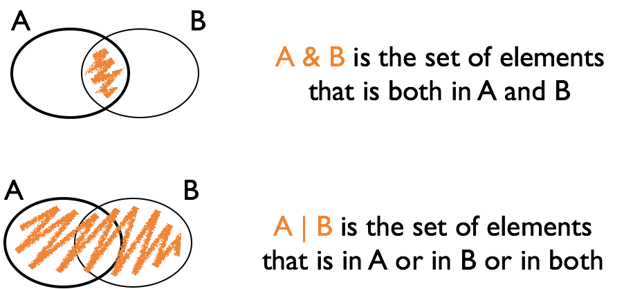

## The pipe operator `%>%`


`f(x) %>% g(y)` is equivalent to `g(f(x), y)`

i.e. the output of one function is used as input to the next function. This function can be the identity

Consequences:

- `x %>% f(y)` is the same as `f(x, y)`

- statements of the form `k(h(g(f(x, y), z), u), v, w)` become
`x %>% f(y) %>% g(z) %>% h(u) %>% k(v, w)`

- read `%>%` as "then do"

---

## Using the pipe `%>%`

```
ggplot(data = filter(fbi, type=="homicide", 
aes(x = year, y = count)) + geom_point()
```

becomes

```
library(tidyverse)

fbi %>% 
  filter(type=="homicide") %>%
  ggplot(aes(x = year, y = count)) + 
    geom_point()
```

```{r echo=FALSE, message=FALSE}
library(tidyverse)
```
---
class: inverse, center, middle
# Logical variables, filters, and updating data

---

## Logical vectors

- Vectors consisting of values `TRUE` and `FALSE`

- Usually created with a logical comparison

  - `<, >, ==, !=, <=, >=`

  - `x %in% c(1, 4, 3, 7)`

- Used in `subset` or `dplyr::filter`

---

## Combining logical expressions

- `&` and `|` are the logical *and* and *or*

- `!` is the logical negation

- use parentheses () when linking expressions to avoid mis-interpretation

---

## Logical Operations




---
class: inverse
## Your turn 


Define vector `a` to be `a <- c(1, 15, 3, 20, 5, 8, 9, 10, 1, 3)`


Find the expression for the logical vector that is TRUE where `a` is:

- less than 20

- squared value is at least 100 or less than 10

- equals 1 or 3

- even <br>
Hint: have a look at the help for the operator `%%`

---

## `filter {dplyr}`

`filter` is a command of package `dplyr`

`filter(data, ...)` finds subset of `data` where conditions specified by logical expression in `...` are true, e.g.

  - `filter(fbi, year == 2014)`
  - `filter(fbi, type == "larceny", state %in% c("Iowa", "Minnesota"))`

multiple expressions are implicitly combined by a logical and `&`

Note that the command `subset` works very similarly.

Caution! there is another function called `filter` in the `stats` package. Use `::` to make sure you use the right one: `dplyr::filter`

---
class: inverse
## Your turn 

Use the `fbi` data from the `classdata` package

- Get a subset of all crimes in Iowa, Plot incidences/rates for one type of crime over time.

- Get a subset of all crimes in 2009. Plot the number or rate for one type of crime by state.

- Get a subset of the data that includes number of homicides for the last five years. Find the rate of homicides, extract all states that have a rate of greater than 90% of the rates across all states, and plot (Hint: `?quantile`).


Extra credit (1 point): submit your code (regardless of whether it works or not) in Canvas (yourturn-checkin-1).

---

## Information extraction: useful commands

Number of records in a data set:
```
nrow(dataset)  
```

Quantiles:
```
quantile(variable, probs=0.001, na.rm=T)  
```

Find all indices for which an expression is TRUE:
```
which(logical variable)  
```

Retrieve index of maximum/minimum value:
```
which.max(variable)
which.min(variable) 
```

---
class: inverse
## Your turn 


Use the `fbi` data object to answer the following questions: 

- how many reports of Burglaries are there for California?

- for any of the violent crimes, which state had the highest rate (and for which crime) in 2014? in 1961? 


Use the `fbiwide` data object to answer the following question: 

- in how many states in 2011 were there more vehicle thefts than robberies? (which states are those?)


---

## Updating elements in a vector

You can take a subset and update the original data:
```{r}
a <- 1:4
a

a[2:3] <- 0
a

replace(a, a == 0, -1)
```

Very useful in combination with logical subsetting

---

## Updating elements in a data set

data sets and their parts can be used as right hand side of an assignment:

```{r}
library(classdata)

# introduces new variable in the data set fbiwide
fbiwide$murder.rate <- fbiwide$homicide/fbiwide$population*100000

names(fbiwide)
```

if that variable exists before, it is being over-written/updated

---

## `mutate {dplyr}` 

`mutate` is a function from the `dplyr` package

It allows us to introduce/upate variables in a dataset 

```{r}
fbiwide <- fbiwide %>% 
  mutate(
    murder.rate = homicide/population*100000
  )
```

Allows us to focus on the WHAT, rather than the HOW.


