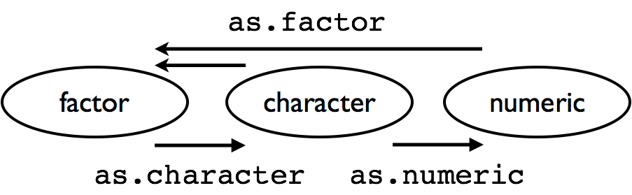

# Factors

- A special type of variable to indicate categories

- both *labels* and their *order* (i.e. numbers) 

- By default text variables are stored in factors during input

- numeric categorical variables have to be converted to factors manually

- `factor` creates a new factor with specified labels


---
class: inverse
# Your Turn 

- Inspect the `fbi` object. How many variables are there? Which type does each of the variables have?

- Make a summary of Year

- Make Year  a factor variable: `fbi$year <- factor(fbi$year)`

- Compare summary of Year to the previous result

- Are there other variables that should be factors (or vice versa)? 

---

# Note: factors in boxplots

boxplots in ggplot2 only work properly if the x variable is a character variable or a factor:

```{r, echo=FALSE, warning=FALSE, message= FALSE}
library(ggplot2)
library(classdata)
```

```{r}
twoyear <- dplyr::filter(fbi, year %in% c(1961, 2016))
```

.pull-left[
```{r, fig.width=3, fig.height = 3, message = FALSE, warning = FALSE}
ggplot(data = twoyear, 
       aes(x = year, 
           y = count)) + 
  geom_boxplot()
```
]

.pull-right[
```{r, fig.width=3, fig.height = 3, message = FALSE, warning = FALSE}
ggplot(data = twoyear, 
       aes(x = factor(year), 
           y = count)) + 
  geom_boxplot()
```
]


---

# Data types: checking and casting

Checking for, and casting between types: 

- `str`, `mode` provide info on type

- `is.XXX` (with XXX either `factor, int, numeric, logical, character, ...` ) checks for specific type

- `as.XXX` casts to specific type

---

# Casting between types



**Note:** `as.numeric` applied to a factor retrieves *order* of labels, not labels, even if those could be interpreted as numbers.

To get the labels of a factor as numbers, first cast to character and then to a number.

---

# Levels of factor variables

- `levels(x)` shows us the levels of factor variable `x` in their current order

- factor variables often have to be re-ordered for ease of comparisons

- We can specify the order of the levels by explicitly listing them, see `help(factor)`

- We can make the order of the levels in one variable dependent on the summary statistic of another variable


---

# Reordering factor levels - manual

```{r}
fbi$type <- factor(fbi$type)
levels(fbi$type)
```

manually (extremely sensitive to typos):

```{r}
levels(factor(fbi$type, levels=c("larceny", "burglary", "motor_vehicle_theft", "aggravated_assult", "robbery", "rape_legacy", "homicide", "rape_revised")))
```

---

# Reordering factor levels - using another variable

`reorder(factor, numbers, function)`

reorder levels in factor by values in `numbers`. Use `function` to summarise (average is used by default). 

```{r}
levels(reorder(fbi$type, fbi$count, na.rm=TRUE))
```

missing values in `numbers`? make sure to use parameter `na.rm=TRUE`!


---
class: inverse
## Your turn 


For this your turn use the `fbi` object from the `classdata` package. 

- Introduce a rate of the number of reported offenses by population into the `fbi` data. You could use the *Ames standard* to make values comparable to a city of the size of Ames and Story county (population ~100,000).

- Plot boxplots of crime rates by different types of crime. How can you make axis text legible? 

- Reorder the boxplots of crime rates, such that the boxplots are ordered by their medians. 

- For one type of crime (subset!) plot boxplots of rates by state, reorder boxplots by median crime rates


---

# Changing Levels' names

```{r}
levels(fbi$type)
```

```{r}
levels(fbi$type)[4] <- "murder"

levels(fbi$type)
```

---

# Read more on factors

- Wickham & Grolemund's <a href="http://r4ds.had.co.nz/factors.html">chapter on factors</a> in *R for Data Science*

- Roger Peng: [*stringsAsFactors: An unauthorized biography*](http://simplystatistics.org/2015/07/24/stringsasfactors-an-unauthorized-biography/")

- Thomas Lumley: <a href="http://notstatschat.tumblr.com/post/124987394001/stringsasfactors-sigh"><em>stringsAsFactors = &lt;sigh&gt;</em></a> 

- The <a href="https://forcats.tidyverse.org/">`forcats` package</a> has a lot of additional functions that make working with factors easier.
