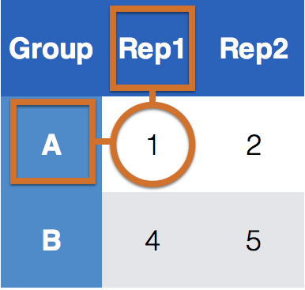
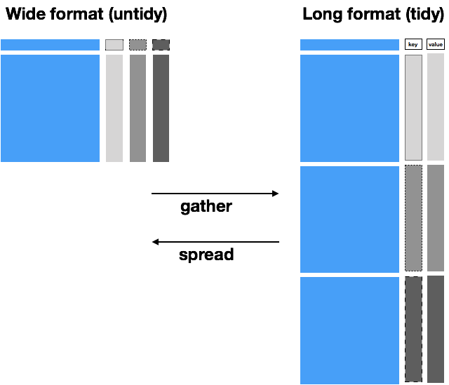
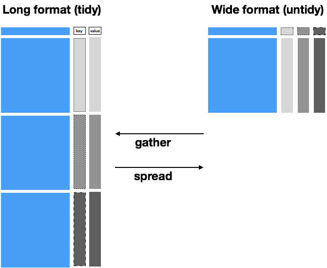
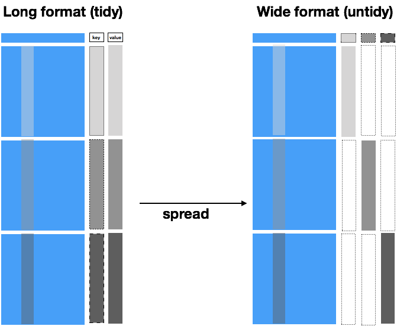

class: middle, inverse, center
# The `tidyr` package

```{r setup, include=FALSE}
knitr::opts_chunk$set(echo = TRUE)
library(tidyverse)
data(french_fries, package="reshape2")
```

---

# What is tidy data?

> Happy families are all alike; every unhappy family is unhappy in its own way.<br>
Leo Tolstoy

- `tidyr` vignette available as `vignette("tidy-data", package="tidyr")`

- vignette is updated version of the [tidy data paper](https://www.jstatsoft.org/article/view/v059i10) with updated code

---

# Outline

- Different sources of messiness

- Key-Value pairs

- `tidyr`: `pivot_longer` and `pivot_wider` (former `gather` and `spread`)


---

# Data often is in a spreadsheet format, but ...

there's different ways of encoding the same information:

Option #1
```{r echo = FALSE}
read.csv("data/preg.csv")
```

Option #2
```{r echo = FALSE}
read.csv("data/preg2.csv")
```

Neither #1 nor #2 are "clean" versions of the data: observed information is part of the data structure; some implicit information is assumed

---

# Sources of Messiness

1. Column headers are values, not variable names.<br>
e.g. *treatmenta, treatmentb*

2. Multiple variables are stored in one column.<br>
e.g. *Fall 2015, Spring 2016* or *"1301 8th St SE, Orange City, Iowa 51041
(42.99755, -96.04149)", "2102 Durant, Harlan, Iowa 51537
(41.65672, -95.33780)"*

3. Multiple observational units are stored in the same table.

4. A single observational unit is stored in multiple tables.

---

# Tidy data


1. Each variable forms one column.

2. Each observation forms one row.

3. Each type of observational unit forms a table.

---

# Clean version of the example

```{r echo = FALSE}
preg2 <- read.csv("data/preg2.csv")
preg2 %>% gather(key = patient, value = score, 2:4) %>% 
  mutate(patient = gsub("\\.", " ", patient))
```

- `treatment` and `patient` uniquely describe a single row in the dataset.

- `treatment` and `patient` are **key variables**,

- `score` is a **measurement variable**

- this makes `treatment-patient` and `score` a **key-value pair**


---

# Key-value pairs (KVP)
 
**Key-Value pairs** (KVP) - also *attribute-value*, *field-value*, *name-value*:
abstract data representation that allows a lot of flexibility  

One way of telling whether a data set is tidy is to check that all keys for a value are aligned in one row:

| | |
|:------------- |:------------- | 
| | |
|  |      | 
|Untidy data | Tidy data |

---

# Tidying data - Plan of attack

Very few functions are needed for tidying data:

- Messy (1): `tidyr` functions `pivot_longer` and `pivot_wider`.  
`pivot_longer(data,  cols, names_to = "name", values_to = "values")`: take multiple columns and collapse into key-value pairs <br>
`pivot_wider (data, names_from=name, values_from=value)`: spread a key-value pair across multiple columns.

- Messy (2): `tidyr` function `separate (data, col, into, sep = "[^[:alnum:]]+")`:
separate one column into multiple columns

- Messy (3): `dplyr` - some combination of the functions discussed previously

- Messy (4): `dplyr` functionality `join` (and friends) to combine multiple data sets 

---

# French fries data

```{r}
data(french_fries, package="reshape2")
```

- data from sensory experiment conducted at Iowa State University in 2004

- investigators were interested in comparing effects of three different fryer oils on taste of fries

```{r}
french_fries %>% head()
```

---

# Gather/Pivot to long

```{r}
ffm <- french_fries %>% 
  pivot_longer(cols = potato:painty, 
               names_to = "scale", 
               values_to = "score")
ffm
```

---

# Gather/Pivot to long



---

# Pivot to wide

```{r}
ffm %>% pivot_wider(names_from = rep, values_from = score)
```

---

# Pivot to wide

formerly: 

```{r}
ffm %>% spread(key = rep, value = score)
```
---

# Pivot to wide

```{r}
ffm %>% pivot_wider(names_from = rep, values_from = score, names_prefix="Rep")
```

---

```{r warning=FALSE}
ffm %>% pivot_wider(names_from = rep, values_from = score, names_prefix="Rep") %>%
  ggplot(aes(x = Rep1, y = Rep2)) + geom_point() +
  facet_wrap(~scale) + geom_abline(colour = "grey50")
```

---
class: inverse
# Your turn 

For this your turn use the `french_fries` data from the `reshape2` package: `data("french_fries", package="reshape2")` 

- Use `pivot_longer` from the `tidyr` package to combine the different scales for assessing french fries into a single variable. Call the key-value pair "scale" and "score". 

- Use  `pivot_wider` from the `tidyr` package to get a format in which you can directly compare values from week 1 to week 10. Plot a scatterplot of values in week 1 against week 10. Facet by treatment and scale, color by individuals   and use different shapes for the replicates. Is there a pattern visible?

---
class: inverse
# Your turn 

For this your turn use the `fbiwide` data from the `classdata` package: `data("fbiwide", package="classdata")` 

- Use  `pivot_longer` from the `tidyr` package to combine the variables for the different types of crimes into one variable. Call the key-value pair "Type" and "Incidences". Compute a crime rate

- Only consider crime rates for Iowa and Minnesota. Use `pivot_wider` to create incidence columns for each of these states. Plot crimes in Iowa against crimes in Minnesota, colour by type of crime. Note: you need to exclude some variables. 

---

# `pivot_wider` works as 

... the inverse of `pivot_longer` ... almost



---

# If the front part is not identical

... it's not collapsible



---

# Where using `pivot_wider` is tricky

- `spread`/`pivot_wider` is the (almost) inverse operation of `gather`/`pivot_longer`

- when we use `gather`/`pivot_longer` the key information is duplicated

- when using `spread`/`pivot_wider` we need to make sure that the information outside the key and value is identical for all levels (and combinations of levels) of the `key` variable.

- If the info is not identical across levels, missing values are introduced into the new data set.

---

# `spread`/`pivot_wider` in the example

```{r, message=FALSE, warning=FALSE}
library(classdata)
fbi %>% filter(year==2014, state_abbr %in% c("IA", "MN"),
               type=="burglary")
```

Other state specific values don't allow spread to collapse the front part and introduce missing values:

```{r}
fbi %>% filter(year==2014, state_abbr %in% c("IA", "MN"),
               type=="burglary") %>%
  pivot_wider(names_from="state_abbr", values_from="count")
```

---

# fixing `pivot_wider` in the example

Negative selection of all state specific variables gets the example to "work": 

```{r}
fbi %>% filter(year==2014, state_abbr %in% c("IA", "MN"),
               type=="burglary") %>%
  select(-state, -state_id, -population) %>%
  pivot_wider(names_from="state_abbr", values_from="count")
```
